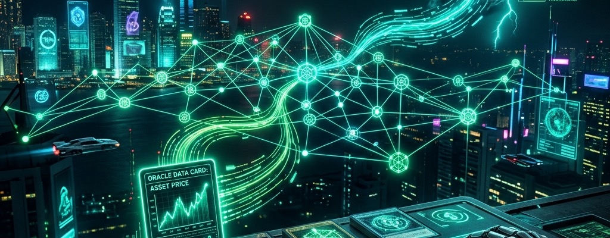
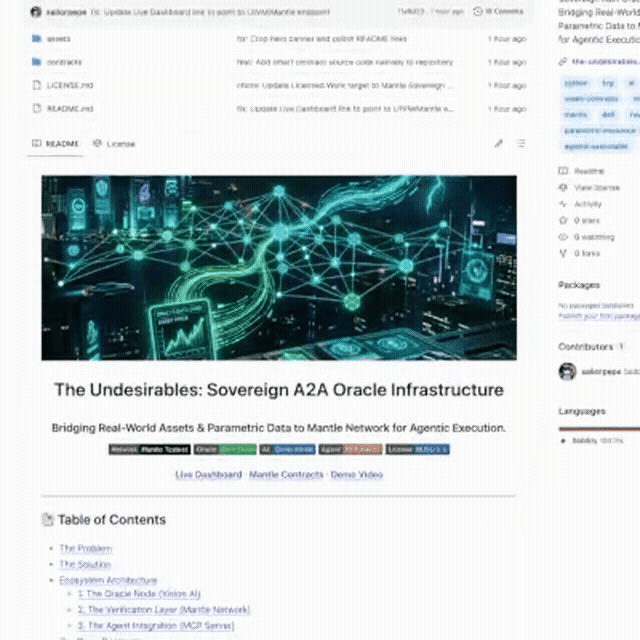
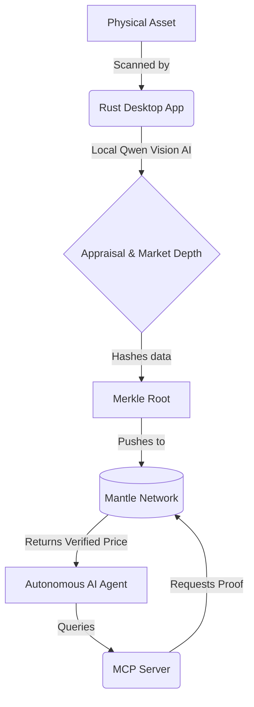

<p align="center">
  
</p>

<h1 align="center">The Undesirables: Sovereign A2A Oracle Infrastructure</h1>

<h3 align="center">Bridging Real-World Assets & Parametric Data to Mantle Network for Agentic Execution.</h3>

<p align="center">
  
  
  
  
  
</p>

<p align="center">
  <a href="https://the-undesirables.com/litvm"><strong>Live Dashboard</strong></a> ·
  <a href="#on-chain-contracts"><strong>Mantle Contracts</strong></a> ·
  <a href="https://x.com/sailorpepe_eth/status/2064447041103642978"><strong>Demo Video</strong></a>
</p>

<p align="center">
  
  <br>
  <em>Live demo — <a href="https://the-undesirables.com/litvm">try it yourself →</a></em>
</p>

---

## 📑 Table of Contents
- [The Problem](#the-problem)
- [The Solution](#the-solution)
- [Ecosystem Architecture](#ecosystem-architecture)
  - [1. The Oracle Node (Vision AI)](#1-the-oracle-node-vision-ai)
  - [2. The Verification Layer (Mantle Network)](#2-the-verification-layer-mantle-network)
  - [3. The Agent Integration (MCP Server)](#3-the-agent-integration-mcp-server)
- [On-Chain Contracts](#on-chain-contracts)
- [Quick Start for Agents](#quick-start-for-agents)
- [License](#license)

---

## The Problem
Current blockchain oracles are built for *humans* to read crypto prices. They are opaque, heavily centralized, and rely on multi-sig committees to push data on-chain. 

If we want to build a true **Agentic Economy** where autonomous AI agents execute financial strategies, assess collateral, and manage portfolios, those agents cannot rely on blind trust. They need an **Agent-to-Agent (A2A) Oracle** that allows them to independently verify the data they are consuming.

## The Solution
We built the first Sovereign A2A Oracle Infrastructure specifically designed for the **Mantle Network**.

By combining local Vision AI models, the Model Context Protocol (MCP), and cryptographic Merkle Roots, we allow autonomous agents to trustlessly verify and trade against **Real-World Assets (physical trading cards)** and **Parametric Data (Weather)**.

---

## Ecosystem Architecture

This submission is an integrated suite of infrastructure. Below are the core components:



### 1. The Oracle Node (Vision AI)
A natively compiled Tauri/Rust desktop application. It uses local Vision AI to scan physical trading cards, grade their condition, query live market depths, and prepare the data for on-chain submission.
*   **Repository:** [tcg-oracle-app](https://github.com/sailorpepe/tcg-oracle-app) (Rust / React codebase)

### 2. The Verification Layer (Mantle Network)
Our smart contracts deployed on the **Mantle Testnet** act as the ultimate source of truth. We publish hourly Merkle roots containing 284,000+ RWA prices and hourly TWAP feeds.
*   **Source Code:** [Mantle Smart Contracts Repository](./contracts)

### 3. The Agent Integration (MCP Server)
An open-source Python MCP server that allows any AI agent (Claude, ElizaOS) to query our market memory and instantly request a Merkle proof to verify the price against the Mantle blockchain.
*   **Source Code:** [Mantle MCP Agent Server](https://github.com/sailorpepe/tcg-oracle-webmcp)

### 4. The Weather Engine (Parametric Data)
A secondary oracle engine that pulls 1-minute ASOS sensor data from the National Weather Service and cross-references it against Kalshi prediction markets to execute automated parametric DeFi payouts.
*   **Source Code:** [Weather Engine (Oracle Node)](oracle-node/)

---

## On-Chain Contracts

We have successfully deployed our infrastructure to the **Mantle Testnet** (Chain ID: `5003`).

| Contract Name | Address | Purpose |
|--------------|---------|---------|
| **TCGPriceOracleV2** | [`0x1A486...63B4`](https://explorer.sepolia.mantle.xyz/address/0x1A48672001df4F11346D039BD9d67009B37F63B4) | Hourly TWAP for top 50 blue-chip RWA cards |
| **MerklePriceOracle** | [`0x6B31b...D8072c`](https://explorer.sepolia.mantle.xyz/address/0x6B31b3735D88b148d47255EdAa4DD74A65D8072c) | Hourly Merkle root for 284,000+ priced products (of 446K indexed) |
| **WeatherEdgeOracle** | [`0xe0dCD...53451`](https://explorer.sepolia.mantle.xyz/address/0xe0dCD77D245480CEB830EA66B74849101F853451) | Hourly NWS Parametric data verification |


---

## Quick Start for Agents

Our infrastructure natively supports the new **WebMCP** standard, allowing any AI agent to discover and call our oracle tools directly from the browser without any API keys or local configuration.

If you are evaluating this project and want to test the Agentic Integration, simply add this single line to your HTML page:

```html
<script src="https://oracle.the-undesirables.com/static/tcg-oracle-webmcp.js"></script>
```

Then simply ask your AI: *"What is the verified price of a Charizard Base Set on the Mantle Network?"* The agent will automatically discover the oracle tools via `navigator.modelContext`, retrieve the Merkle proof, and verify the price against the Mantle Testnet contract.

---

## 📝 License & Commercial Use

This project is licensed under the **[Business Source License 1.1 (BUSL-1.1)](LICENSE.md)**.

**Licensor:** The Undesirables LLC · **Change Date:** 2030-04-27 · **Change License:** Apache License, Version 2.0

We build in public and support the developer ecosystem — but we also protect the infrastructure and IP of **The Undesirables LLC**.

### ✅ What You CAN Do (Free)

- **Personal & Educational Use** — Download, modify, and run locally for learning, research, or personal projects.
- **Non-Competing Applications** — Integrate our packages into your app, provided your app does not offer TCG market intelligence, pricing aggregation, AI card grading, or on-chain price oracle services as its primary function.
- **MCP / Agent Integration** — Connect your AI agent to our tools for non-commercial use.
- **Community Contributions** — Security audits, bug fixes, and PRs are always welcome.

### 🚫 What You CANNOT Do (Use Limitation)

- **Competing Service** — You may not use this code to operate a competing TCG market intelligence, pricing aggregation, AI card grading, or on-chain price oracle service.
- **Commercial Resale** — You may not wrap our API, data pipelines, or AI models into a paid service without a commercial license.
- **Hosted SaaS** — You may not host this software as a service for third parties without written permission.

### 🔓 Open-Source Conversion

On **June 1, 2030** (or 4 years after the first public release of each version), this code automatically converts to the **MIT License** — fully open source, forever.

### 🤝 Commercial Licensing

Building a commercial product? Want guaranteed API access or white-label integration? Contact us:

📧 **theundesirables7@gmail.com** · 🐦 **[@undesirables_ai](https://x.com/undesirables_ai)**

© 2026 The Undesirables LLC
